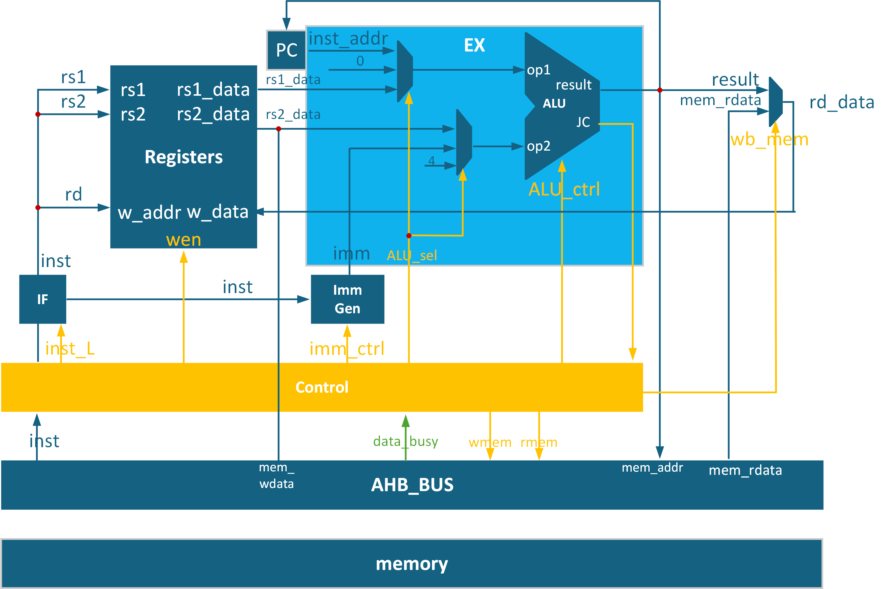

# 初衷

1. 本人暑假时看完了《数字设计系统方法》,对CPU设计十分感兴趣
2. 想到设计一个极小CPU
3. 因此取名nano_riscv,寓意极小的资源/面积消耗

## 介绍

- 本项目实现:实现riscv32I ISA的节拍式CPU
  - 使用verilog语言编写,不使用IP核,提升通用性
  - 与外接通信符合AHB时序,暂未添加反压功能

- 为缩小面积,效仿x86架构的祖师爷:8086
  - 冯诺依曼架构,inst memory 与 data memory 共用
  - 节拍式设计分时复用硬件资源,降低面积开销

- 关于内核rtl文件
  - 在rtl/utils/DFF.v定义了标准DFF模块
  - 内核文件均在rtl/core/文件夹中
  - top文件为rtl/core/riscv.v
  - 其余为便于测试的SOC外围电路设计

- 执行指令消耗CLK数
  - 非load指令,消耗两拍
  - load指令,消耗三拍

- 工作原理
  - 详见设计文档[design_document](doc/design_document.md)
  - 附有测试教程[test_tutorial](doc/test_tutorial.md)

## 框图



## 特点

可修改[defines.v](rtl/defines.v)来快速调整CPU参数,如字长Wordnum,寄存器数量Regnum

内核采用工业RTL风格编码规范

- 使用明确的assign语法编写
  - “与或”逻辑一定能够保证综合成并行选择的电路

``` verilog
assign out  = ({4{sel1}} & in1[3:0]) |
              ({4{sel2}} & in2[3:0]) |
              ({4{sel3}} & in3[3:0]) ;
```

- 使用标准DFF 模块例化的寄存器
  - 便于全局替换寄存器类型
  - 便于在寄存器中全局插入延迟
  - 明确的load_enable 使能信号
    - 降低动态功耗:便于综合工具自动插入寄存器级别的门控时钟
  - 规避if-else不能传播错误信号(x/z)的问题
    - 避免bug在仿真过程中被掩盖

## 未来计划

- 添加更多功能,如实现反压,使用AHB接口
- 减少面积消耗
- FPGA上板测试
- 使用本项目走一遍数字设计流程
